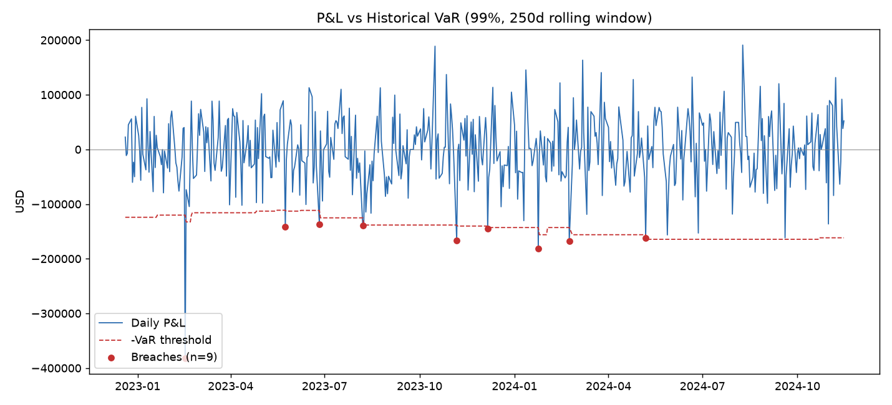

# Market Risk Toolkit: VaR Backtesting Engine + FRTB SA Capital Calculator


A small end-to-end project built after finishing FRM Part 2. It does two
things risk teams actually do day to day: measure 1-day VaR / Expected
Shortfall three different ways and backtest them properly, and compute a
standardized-approach capital charge under FRTB.



## Why this exists

Anyone can say "I know what VaR is." This repo computes it three ways on the
same book, backtests each method with the statistical tests regulators
actually use (Kupiec, Christoffersen), and shows where the methods disagree
and why. It then does the equivalent exercise for FRTB's Sensitivities-Based
Method, which is the part of the syllabus that's hardest to turn into
working code.

**Headline result** (see `outputs/backtest_historical.png` and the console
output): parametric VaR gets statistically rejected by the Kupiec test on
this sample — too many breaches relative to the 99% confidence level —
while historical and Monte Carlo VaR are not rejected. That's the textbook
case for why parametric VaR under-reserves for fat-tailed, non-normal
returns, and part of why regulators pushed toward Expected Shortfall under
FRTB instead of a single VaR number.

## Project structure

```
market-risk-toolkit/
├── data/
│   └── make_dataset.py      # builds a synthetic 5-asset price history
├── src/
│   ├── var_engine.py        # Historical / Parametric / Monte Carlo VaR & ES
│   ├── backtest.py          # rolling backtest + Kupiec + Christoffersen + traffic light
│   ├── frtb_calculator.py   # FRTB SA delta risk charge (SBM aggregation logic)
│   └── main.py              # runs everything, prints report, saves charts
├── tests/
│   ├── test_var_engine.py
│   ├── test_backtest.py
│   └── test_frtb_calculator.py
├── outputs/
│   └── backtest_historical.png
├── requirements.txt
├── requirements-dev.txt
└── LICENSE
```

## Getting started

```bash
git clone https://github.com/<your-username>/market-risk-toolkit.git
cd market-risk-toolkit
pip install -r requirements.txt

python data/make_dataset.py     # generates data/prices.csv
python src/main.py              # runs VaR, backtest, and FRTB sections
```

Running `src/main.py` prints:
- A VaR/ES summary table across all three methods
- A rolling 250-day backtest with breach counts, Basel traffic-light zone,
  Kupiec POF p-value, and Christoffersen independence p-value, per method
- A worked FRTB SA delta capital charge on a small hypothetical book (GIRR,
  Equity, FX), across the three prescribed correlation scenarios

and saves a P&L-vs-VaR chart with breaches marked to `outputs/`.

### Running the tests

```bash
pip install -r requirements-dev.txt
pytest tests/ -v
```

14 tests covering VaR/ES sanity checks (non-negativity, ES ≥ VaR, scaling
with portfolio value), the backtest statistics (Kupiec correctly
accepting/rejecting known breach rates, Christoffersen catching clustering),
and the FRTB aggregation math (no-diversification edge case, netting of
offsetting positions, worst-case scenario selection).

## A note on the data

Synthetic data used so the project is reproducible without a data licence, so `data/make_dataset.py` generates a synthetic 3-year daily price
history for a 5-asset book (an equity index, EURUSD, a rates future, crude,
gold) using correlated Student-t shocks plus a short synthetic stress
window — so the backtests actually see some breaches instead of a
suspiciously clean run.

**To run this on real data instead**, swap `make_dataset.py`'s output for a
real pull, e.g.:
```python
import yfinance as yf
df = yf.download(["SPY", "EURUSD=X", "^TNX", "CL=F", "GC=F"], start="2021-01-01")["Close"]
df.to_csv("data/prices.csv")
```
Everything downstream (`var_engine.py`, `backtest.py`) is data-agnostic — it
just expects a CSV of prices with a date index, so nothing else needs to
change.

## Scope and honest limitations

- The FRTB calculator implements **delta risk only**, for GIRR, Equity, and
  FX. It doesn't include vega, curvature, the Default Risk Charge, or the
  Residual Risk Add-On — real capital under FRTB SA is all of those
  summed, not just this piece.
- Risk weights and correlation parameters in `frtb_calculator.py` are
  illustrative, in the spirit of the BCBS framework's structure, not copied
  from a current regulatory technical standard. A production
  implementation would source those from the latest local regulator's
  published tables.
- Monte Carlo VaR fits a Student-t distribution to historical returns
  rather than running a full multivariate simulation with a stochastic
  volatility model — a reasonable simplification for a project like this,
  worth naming rather than presenting as production-grade.

## Possible extensions

- Add vega and curvature risk charges to the FRTB calculator
- Add a GARCH(1,1) conditional volatility forecast as an alternative to the
  rolling-window VaR (conditional VaR instead of unconditional)
- Wrap `main.py`'s output in a small Streamlit dashboard for interactive
  exploration

## License

MIT — see [LICENSE](LICENSE).
